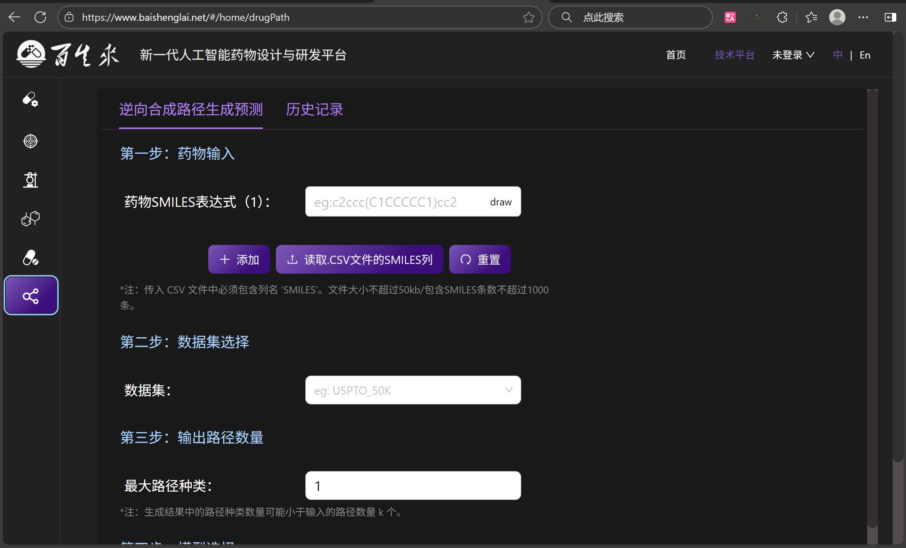

<div align="center">

# 🌐 Baishenglai Backend  
Choose Language: <b>🇬🇧 English</b> ｜ [🇨🇳 中文](./README.zh.md)

</div>

---

## 🖼️ Interface Showcase

<div align="center">


<table>
<tr>
<td></td>
<td></td>
</tr>
<tr>
<td></td>
<td></td>
</tr>
<tr>
<td></td>
<td></td>
</tr>
<tr>
<td></td>
<td></td>
</tr>
</table>

</div>

---

## 🚀 Features

**Baishenglai Backend** is a high-performance backend service framework based on Django,
designed for modern web applications. It integrates Celery for async task processing, Redis caching, and JWT authentication to provide stable and reliable backend support.


[](https://github.com/JohnLinabcd/baishenglai_backend/commits/main)

---

### Core Features

* 🔐 **JWT Authentication** – Secure user login and authorization  
* 📊 **Async Task Handling** – Powered by Celery  
* 💾 **Redis Caching** – High-performance caching solution  
* 🌐 **CORS Support** – Cross-origin configuration  
* 📈 **Database Management** – MySQL integration and optimization  
* 🛡️ **API Security** – RESTful API protection mechanisms  

### Framework Optimization

Built on **Django**, Baishenglai Backend provides multiple optimizations:

* 🔄 **Custom Middleware** – Faster request handling  
* 💬 **Error Handling & Logging** – Complete exception and log management  
* 🔍 **Performance Monitoring** – Integrated debugging tools  
* 🧠 **Smart Caching** – Efficient caching strategies  

---

## ⚙️ System Requirements

| Software | Version |
| -------- | ------- |
| Python   | 3.8+    |
| Django   | 4.1+    |
| MySQL    | 5.7+    |
| Redis    | 6.0+    |

---

## 🛠️ Dependency Installation

### Core Dependencies

```bash
conda install django==4.1
conda install mysqlclient==2.0.3
pip install celery==5.3.6
pip install eventlet==0.36.0
pip install django-cors-headers==4.3.1
pip install djangorestframework-simplejwt==5.3.1
pip install django-redis==5.4.0
```

### Development Tools

```bash
pip install djangorestframework==3.14.0
pip install django-filter==23.3
pip install drf-yasg==1.21.7
pip install python-decouple==3.8
```

### Additional Tools

```bash
pip install pillow==10.0.1
pip install requests==2.31.0
pip install beautifulsoup4==4.12.2
pip install lxml==4.9.3
```

---

## 🚀 Quick Start

```bash
# Clone the project
git clone https://github.com/JohnLinabcd/baishenglai_backend.git
cd baishenglai_backend

# Create a virtual environment
python -m venv venv
source venv/bin/activate  # Linux/Mac
# or venv\Scripts\activate  # Windows

# Install dependencies
pip install -r requirements.txt

# Apply migrations
python manage.py migrate

# Create superuser
python manage.py createsuperuser

# Run development server
python manage.py runserver
```

### Run Celery Worker

```bash
celery -A config worker --loglevel=info
```

---

## 📈 Usage

Baishenglai Backend provides complete RESTful APIs for authentication, user management, and task processing.

Main API Endpoints:

* `/api/auth/` – Authentication  
* `/api/users/` – User management  
* `/api/tasks/` – Task management  

---

## 📁 Project Structure

```
baishenglai_backend/
├── algorithm/              # Algorithm module
├── api/                    # API interfaces
├── dataset/                # Dataset processing
├── djcelery/               # Celery configuration
├── drug/                   # Drug-related module
├── image/                  # Screenshots
├── task/                   # Task management
├── user/                   # User management
├── utils/                  # Utility functions
├── config.py               # Project configuration
├── manage.py               # Django management script
├── uwsgi.ini               # uWSGI configuration
├── requirements.txt        # Dependencies
└── README.md               # Project documentation
```

---

## 📄 License

This project is licensed under the **MIT License** — see the [LICENSE](LICENSE) file for details.

---

## 📞 Contact

* **Project Homepage:** [https://github.com/JohnLinabcd/baishenglai_backend](https://github.com/JohnLinabcd/baishenglai_backend)
* **Report Issues:** [GitHub Issues](https://github.com/JohnLinabcd/baishenglai_backend/issues)

---

<div align="center">

**If this project helps you, please give it a ⭐️!**

</div>

