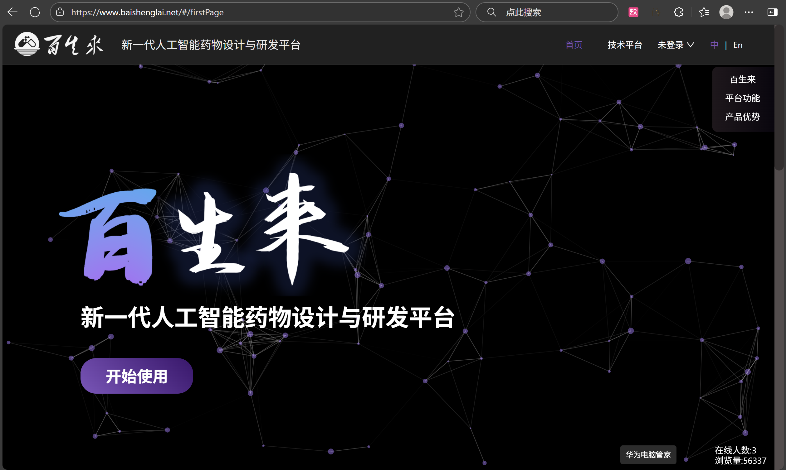
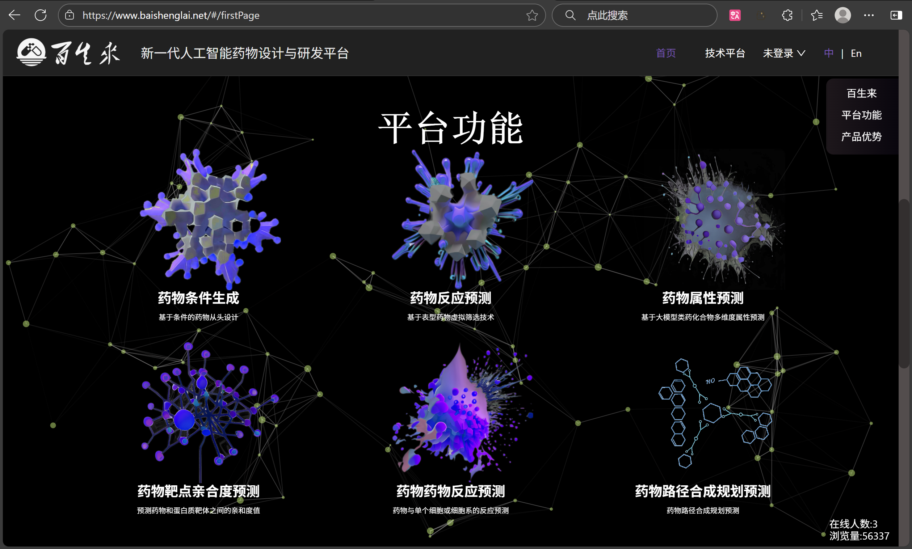
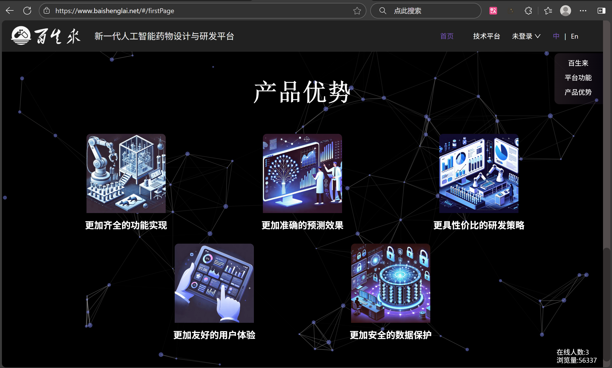
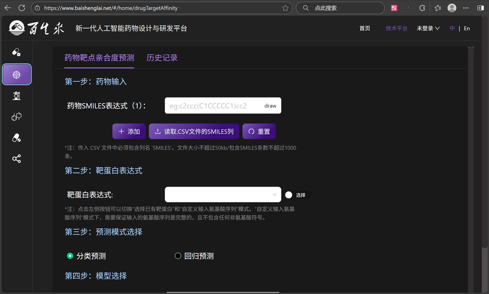

# Baishenglai Backend

**Baishenglai Backend** 是一个基于 Django 的高性能后端服务框架，专为现代 Web 应用设计。它集成了 Celery 异步任务处理、Redis 缓存、JWT 认证等核心功能，提供稳定可靠的后端支持。


[](https://github.com/JohnLinabcd/baishenglai_backend/commits/main)

## 界面展示

<div align="center">
<div style="display: grid; grid-template-columns: repeat(3, 1fr); gap: 20px;">








</div>
</div>

## 目录

- [功能特性](#功能特性)
- [系统要求](#系统要求)
- [依赖安装](#依赖安装)
- [快速开始](#快速开始)
- [使用方法](#使用方法)
- [项目结构](#项目结构)
- [许可证](#许可证)

## 功能特性

### **🚀 核心功能**
Baishenglai Backend 提供完整的后端解决方案，包含以下核心功能：

- **🔐 JWT 身份认证** - 安全的用户认证和授权机制
- **📊 异步任务处理** - 使用 Celery 处理后台任务
- **💾 Redis 缓存** - 高性能数据缓存解决方案
- **🌐 CORS 支持** - 跨域资源共享配置
- **📈 数据库管理** - MySQL 数据库集成与优化
- **🛡️ API 安全** - RESTful API 安全防护

### **⚙️ 框架优化**
基于 **Django** 框架，Baishenglai Backend 进行了多项优化：

- **🔄 中间件优化** - 自定义中间件提升请求处理效率
- **💬 错误处理机制** - 完善的异常处理和日志记录
- **🔍 性能监控** - 集成性能监控和调试工具
- **🧠 缓存策略** - 智能缓存机制提升响应速度

## **⚙️ 系统要求**

运行 Baishenglai Backend 需要以下软件环境：

| 软件名称 | 版本要求 |
|----------|----------|
| Python | 3.8+ |
| Django | 4.1+ |
| MySQL | 5.7+ |
| Redis | 6.0+ |

## **🛠️ 依赖安装**

### 核心框架依赖
```bash
conda install django==4.1
conda install mysqlclient==2.0.3
pip install celery==5.3.6
pip install eventlet==0.36.0
pip install django-cors-headers==4.3.1
pip install djangorestframework-simplejwt==5.3.1
pip install django-redis==5.4.0
```

### 开发工具依赖
```bash
pip install djangorestframework==3.14.0
pip install django-filter==23.3
pip install drf-yasg==1.21.7
pip install python-decouple==3.8
```

### 其他工具依赖
```bash
pip install pillow==10.0.1
pip install requests==2.31.0
pip install beautifulsoup4==4.12.2
pip install lxml==4.9.3
```

## **🚀 快速开始**

### 安装步骤：
> [!IMPORTANT]
> 请确保完成所有安装步骤。

```bash
# 克隆项目
git clone https://github.com/JohnLinabcd/baishenglai_backend.git
cd baishenglai_backend

# 创建虚拟环境
python -m venv venv
source venv/bin/activate  # Linux/Mac
# 或 venv\Scripts\activate  # Windows

# 安装依赖
pip install -r requirements.txt

# 数据库迁移
python manage.py migrate

# 创建超级用户
python manage.py createsuperuser

# 启动开发服务器
python manage.py runserver
```

### 启动 Celery Worker（异步任务）
```bash
# 启动 Celery worker
celery -A config worker --loglevel=info
```

## **📈 使用方法**

通过 API 调用与 Baishenglai Backend 进行交互。系统提供完整的 RESTful API 接口，支持用户认证、数据管理、任务处理等功能。

主要 API 端点：
- `/api/auth/` - 身份认证相关
- `/api/users/` - 用户管理
- `/api/tasks/` - 任务管理

## **📁 项目结构**

```
baishenglai_backend/
├── algorithm/              # 算法模块
├── api/                   # API 接口
├── dataset/               # 数据集处理
├── djcelery/              # Celery 配置
├── drug/                  # 药物相关功能
├── image/                 # 项目截图
├── task/                  # 任务管理模块
├── user/                  # 用户管理模块
├── utils/                 # 工具函数
├── config.py             # 项目配置
├── manage.py             # Django 管理脚本
├── uwsgi.ini             # uWSGI 配置
├── requirements.txt       # 依赖列表
└── README.md             # 项目说明
```

## **📄 许可证**

本项目采用 MIT 许可证 - 查看 [LICENSE](LICENSE) 文件了解详情。

## **📞 联系我们**

- **项目主页**: [https://github.com/JohnLinabcd/baishenglai_backend](https://github.com/JohnLinabcd/baishenglai_backend)
- **问题反馈**: [GitHub Issues](https://github.com/JohnLinabcd/baishenglai_backend/issues)

---

<div align="center">

**如果这个项目对你有帮助，请给个 ⭐️ 星标支持！**

</div>
