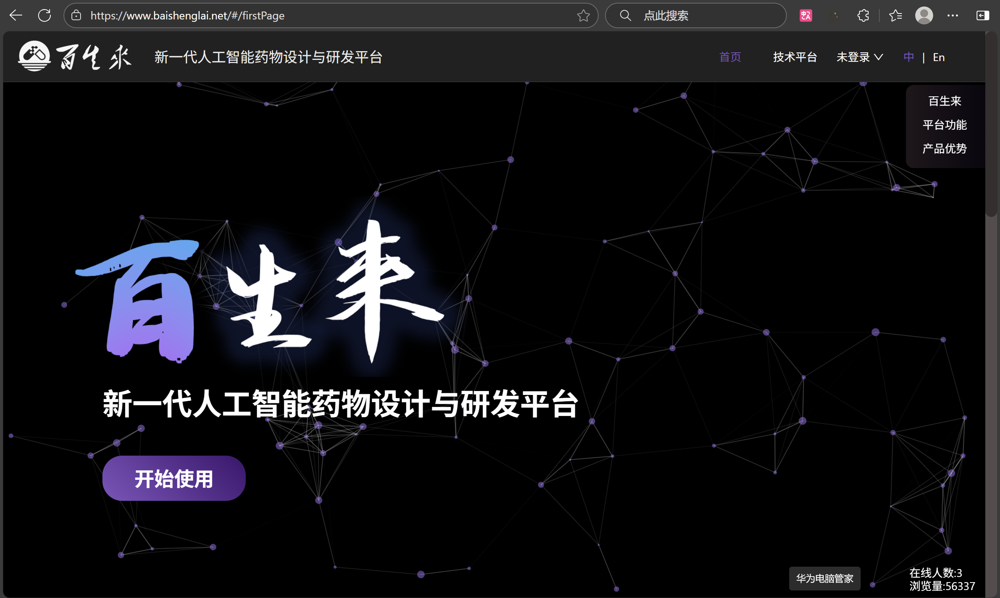
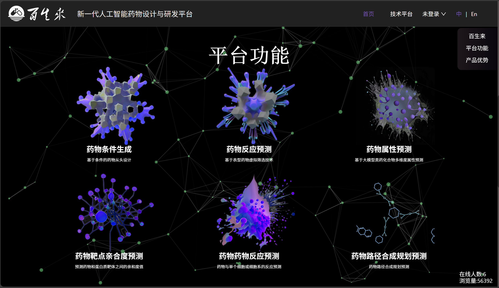
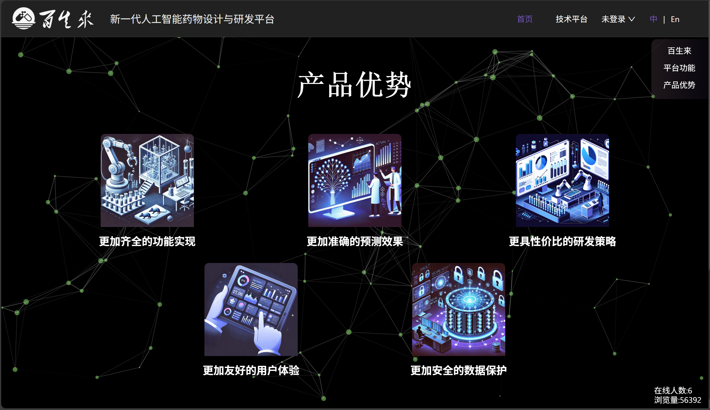
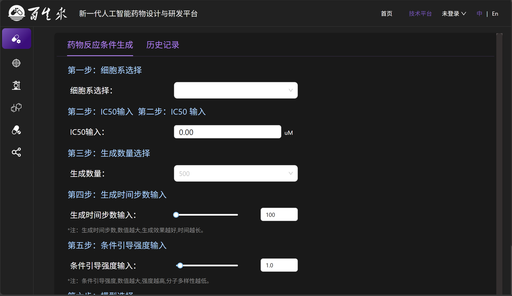
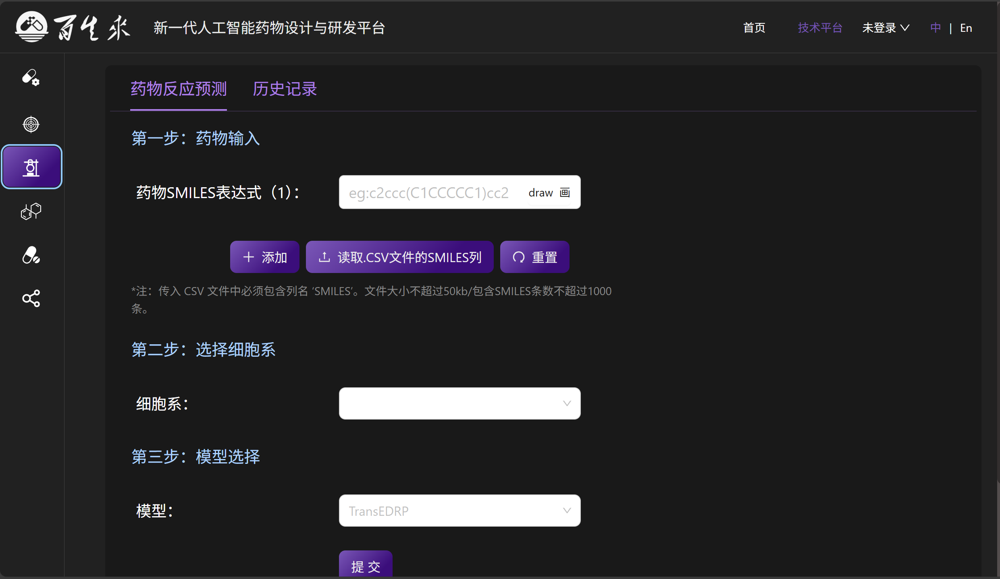
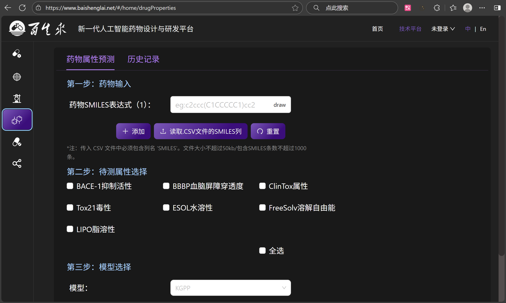
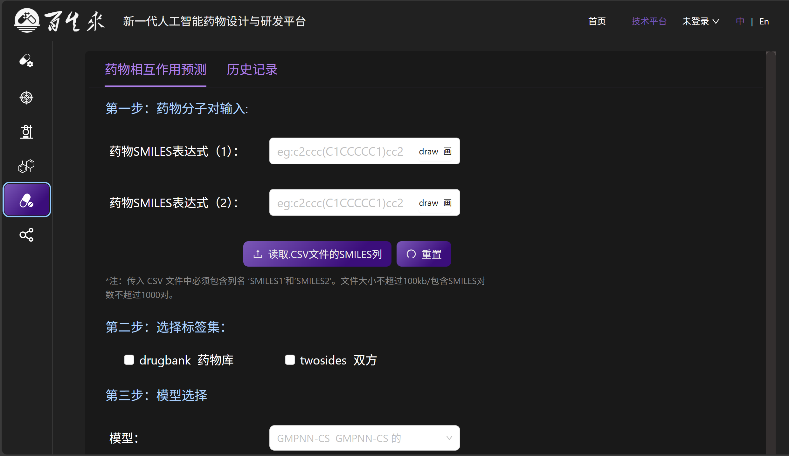
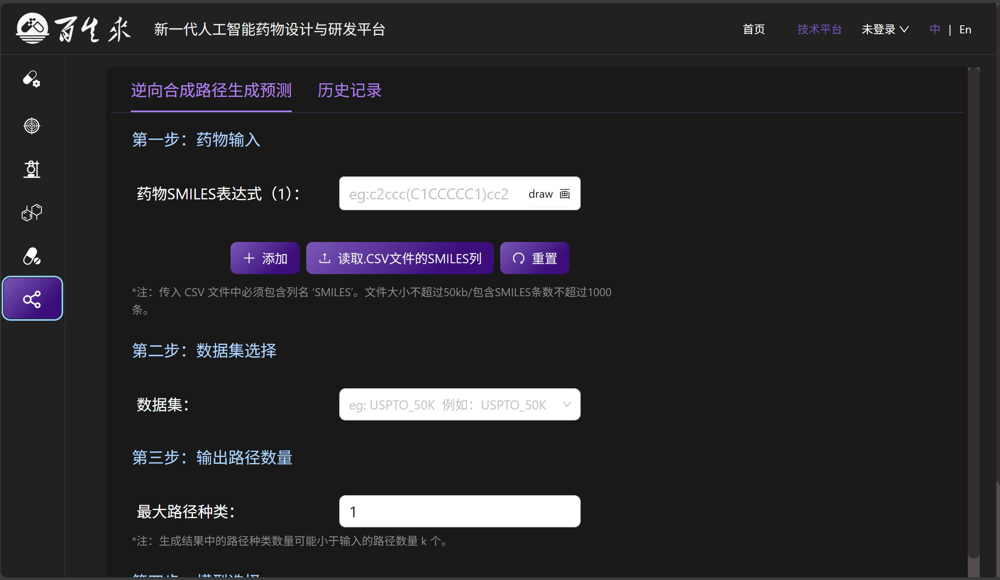

<div align="center">

# 🌐 Baishenglai Backend  
选择语言： [🇬🇧 English](./README.md) ｜ <b>🇨🇳 中文</b>

</div>

---

## 🖼️ 界面展示

<div align="center">



<table>
<tr>
<td></td>
<td></td>
</tr>
<tr>
<td></td>
<td></td>
</tr>
<tr>
<td></td>
<td></td>
</tr>
<tr>
<td></td>
<td></td>
</tr>
</table>

</div>

---

## 🚀 核心功能

**Baishenglai Backend** 是一个基于 Django 的高性能后端服务框架，专为现代 Web 应用设计。  
它集成了 Celery 异步任务处理、Redis 缓存、JWT 认证等核心功能，提供稳定可靠的后端支持。


[](https://github.com/JohnLinabcd/baishenglai_backend/commits/main)

---

### 🔧 核心功能模块

- 🔐 **JWT 身份认证**  
- 📊 **异步任务处理（Celery）**  
- 💾 **Redis 缓存**  
- 🌐 **跨域支持（CORS）**  
- 📈 **数据库优化（MySQL）**  
- 🛡️ **API 安全机制**

### ⚙️ 框架优化

基于 **Django** 框架，Baishenglai Backend 提供多项性能优化：

- 🔄 **自定义中间件** 提升请求处理效率  
- 💬 **异常与日志机制** 完善错误处理  
- 🔍 **性能监控工具** 支持调试分析  
- 🧠 **智能缓存策略** 提升响应速度  

---

## ⚙️ 系统要求

| 软件名称 | 版本要求 |
|----------|----------|
| Python | 3.8+ |
| Django | 4.1+ |
| MySQL | 5.7+ |
| Redis | 6.0+ |

---

## 🛠️ 依赖安装

### 核心依赖

```bash
conda install django==4.1
conda install mysqlclient==2.0.3
pip install celery==5.3.6
pip install eventlet==0.36.0
pip install django-cors-headers==4.3.1
pip install djangorestframework-simplejwt==5.3.1
pip install django-redis==5.4.0
```

### 开发工具依赖

```bash
pip install djangorestframework==3.14.0
pip install django-filter==23.3
pip install drf-yasg==1.21.7
pip install python-decouple==3.8
```

### 其他依赖

```bash
pip install pillow==10.0.1
pip install requests==2.31.0
pip install beautifulsoup4==4.12.2
pip install lxml==4.9.3
```

---

## 🚀 快速开始

```bash
# 克隆项目
git clone https://github.com/JohnLinabcd/baishenglai_backend.git
cd baishenglai_backend

# 创建虚拟环境
python -m venv venv
source venv/bin/activate  # Linux/Mac
# 或 venv\Scripts\activate  # Windows

# 安装依赖
pip install -r requirements.txt

# 数据库迁移
python manage.py migrate

# 创建超级用户
python manage.py createsuperuser

# 启动开发服务器
python manage.py runserver
```

### 启动 Celery Worker

```bash
celery -A config worker --loglevel=info
```

---

## 📈 使用说明

Baishenglai Backend 提供完整的 RESTful API 接口，支持用户认证、任务管理与数据操作。

主要接口：

* `/api/auth/` - 身份认证相关  
* `/api/users/` - 用户管理  
* `/api/tasks/` - 任务管理  

---

## 📁 项目结构

```
baishenglai_backend/
├── algorithm/              # 算法模块
├── api/                    # API 接口
├── dataset/                # 数据集处理
├── djcelery/               # Celery 配置
├── drug/                   # 药物相关模块
├── image/                  # 项目截图
├── task/                   # 任务管理模块
├── user/                   # 用户管理模块
├── utils/                  # 工具函数
├── config.py               # 项目配置
├── manage.py               # Django 管理脚本
├── uwsgi.ini               # uWSGI 配置
├── requirements.txt        # 依赖列表
└── README.md               # 项目说明
```

---

## 📄 许可证

本项目采用 **MIT License**，详情参见 [LICENSE](LICENSE) 文件。

---

## 📞 联系我们

* **项目主页**: [https://github.com/JohnLinabcd/baishenglai_backend](https://github.com/JohnLinabcd/baishenglai_backend)
* **问题反馈**: [GitHub Issues](https://github.com/JohnLinabcd/baishenglai_backend/issues)

---

<div align="center">

**如果这个项目对你有帮助，请给个 ⭐️ 支持！**

</div>
